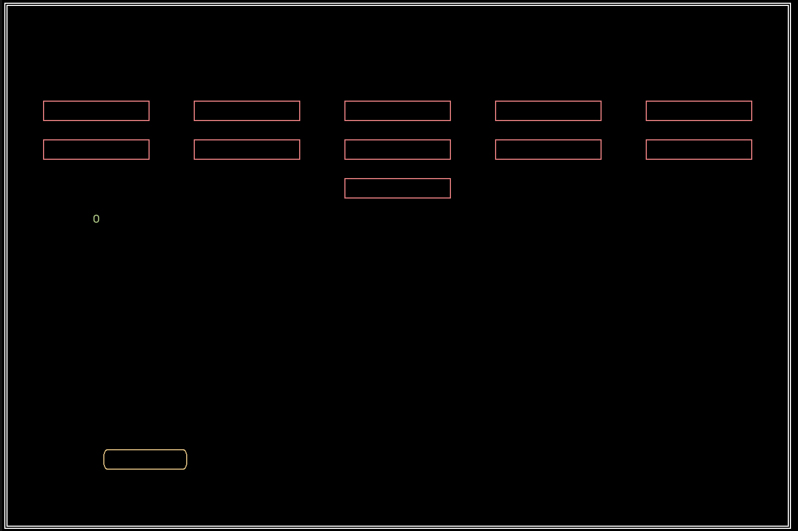

# Rustout
Bad terminal version of breakout using the [ruscii](https://github.com/lemunozm/ruscii) crate.
I was bored at 4am and didn't do anything game and/or rust related in a while.

## Bugs
- Collision is janky af (you can get the ball to bounce underneath the paddle)
- The ball always bouncing off the paddle and bricks in the same angle is kind of boring
